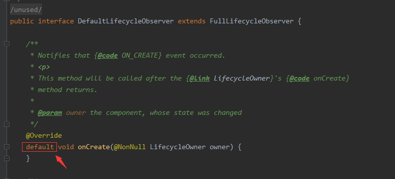

# Lifecycle的介绍与使用

在介绍LiveData和ViewModel之前, 我们需要先知道 `Lifecycle` 。

## Lifecycle是什么? 为什么需要Lifecycle?

我们都知道, 在 `Android` 开发中, 无论是`Activity`还是`Fragment`又或者是`Service`都具有`生命周期`。

就像我们经常在 `onCreate` 中初始化某个组件, `onStart` 中启动它, `onPause` 中停止它, `onDestroy` 中销毁它。

这些大大小小的操作流程一步一步成就了软件的生命体系, 而这些流程一旦被打乱, 就可能带来以下影响:

- 内存泄露(造成软件崩溃、手机内存不足等情况)

- 应用崩溃(无响应、闪退等情况)

- 手机卡顿(运行内存在一瞬间飙升、手机发烫等情况)

举一个官方提到的栗子(获取手机定位信息):

在 `Lifecycle` 没有诞生的情况下, 我们是这样操作的:

```kotlin
/// MyLocationListener
class MyLocationListener(
    private val context: Context,
    private val callback: (Location) -> Unit
) {
    fun connect() {
        /// todo 开始连接
    }

    fun disconnect() {
        /// todo 断开连接
    }
}

/// LocationActivity
class LocationActivity : AppCompatActivity() {
    private lateinit var myLocationListener: MyLocationListener

    override fun onCreate(savedInstanceState: Bundle?, persistentState: PersistableBundle?) {
        super.onCreate(savedInstanceState, persistentState)

        myLocationListener = MyLocationListener(this) { location ->
            /// todo 更新 UI
        }
    }

    override fun onStart() {
        super.onStart()
        myLocationListener.connect()
    }

    override fun onStop() {
        super.onStop()
        myLocationListener.disconnect()
    }
}
```

也正如官网所说, 这么写逻辑上好像是没有什么问题, 但是一旦出现 `onStop` 在 `onStart` 之前结束(二者出现竞争关系), 那么就有可能出现`内存泄露`的情况。

并且, 实际开发中, 类似于上面的功能如果需要在其他页面也能够被使用, 那么就又需要再写一份 `onStart` 和 `onStop`, 这还是在较好的情况下。

为什么这么说呢? 实际开发中这些生命周期函数中的代码可能数十行甚至上百行...

上面提到的这种情况叫`代码耦合性`, 在追求`高类聚, 低耦合`的优雅代码结构中, 这种`藕断丝连, 动辄全身`的代码明显不好。

本文所用开发环境以及SDK版本如下，读者应该使用不低于本文所使用的开发环境.

> Android Studio 4.0.1
> minSdkVersion 21
> targetSdkVersion 30

# 正文

参考前面提到的 **获取手机定位信息** 我们何不让 `MyLocationListener` 直接具有`生命周期`呢?

先上代码, 后文讲解:

```kotlin
class MyLocationListener(
    private val context: Context,
    private val callback: (Location) -> Unit
) : LifecycleObserver {

    @OnLifecycleEvent(Lifecycle.Event.ON_START)
    fun connect() {
        /// todo 开始连接
    }

    @OnLifecycleEvent(Lifecycle.Event.ON_STOP)
    fun disconnect() {
        /// todo 断开连接
    }
}

class LocationActivity : AppCompatActivity() {
    private lateinit var myLocationListener: MyLocationListener


    override fun onCreate(savedInstanceState: Bundle?, persistentState: PersistableBundle?) {
        super.onCreate(savedInstanceState, persistentState)

        myLocationListener = MyLocationListener(this) { location ->
            /// todo 更新 UI
        }

        // 加入生命周期观察
        lifecycle.addObserver(myLocationListener)
    }
}
```

这样, 就直接能够在 `MyLocationListener` 中直接管理定位的状态了。

## 主角 Lifecycle 出场

上面我们说了, `Lifecycle` 作为生命周期的`观察者`, 当`Activity`和`Fragment`生命周期发生变化之后`Lifecycle`就能够直接捕获, 并且响应对应的方法(上面用的是注解实现对应响应)。

Lifecycle 的结构很简单:

- `观察者注册器 (LifecycleRegistry)`继承至`Lifecycle`
- `被观察者 (LifecycleOwner)`
- `观察者 (LifecycleObserver)`

实现逻辑也不算难, 通过 `LifecycleRegistry` 持有 `LifecycleOwner` 最后添加 `LifecycleObserver`。

简单来说 `LifecycleRegistry` 就是连接 `LifecycleOwner` 和 `LifecycleObserver` 的桥梁。

### 实现 Lifecycle 的第一种写法

直接实现 `LifecycleObserver` 接口, 通过注解 `@OnLifecycleEvent` 去观察(监听)到每一个生命周期事件的改变。

```kotlin
class MyLifecycleObserver : LifecycleObserver {
    private val TAG: String = "GLog"

    @OnLifecycleEvent(Lifecycle.Event.ON_CREATE)
    fun onCreate(owner: LifecycleOwner) {
        Log.d(TAG, "onCreate, currentState = ${owner.lifecycle.currentState}")
    }

    @OnLifecycleEvent(Lifecycle.Event.ON_START)
    fun onStart(owner: LifecycleOwner) {
        Log.d(TAG, "onStart, currentState = ${owner.lifecycle.currentState}")
    }

    @OnLifecycleEvent(Lifecycle.Event.ON_RESUME)
    fun onResume(owner: LifecycleOwner) {
        Log.d(TAG, "onResume, currentState = ${owner.lifecycle.currentState}")
    }

    @OnLifecycleEvent(Lifecycle.Event.ON_PAUSE)
    fun onPause(owner: LifecycleOwner) {
        Log.d(TAG, "onPause, currentState = ${owner.lifecycle.currentState}")
    }

    @OnLifecycleEvent(Lifecycle.Event.ON_STOP)
    fun onStop(owner: LifecycleOwner) {
        Log.d(TAG, "onStop, currentState = ${owner.lifecycle.currentState}")
    }

    @OnLifecycleEvent(Lifecycle.Event.ON_DESTROY)
    fun onDestroy(owner: LifecycleOwner) {
        Log.d(TAG, "onDestroy, currentState = ${owner.lifecycle.currentState}")
    }

    @OnLifecycleEvent(Lifecycle.Event.ON_ANY)
    fun onAny(owner: LifecycleOwner) {
        Log.d(TAG, "onAny, currentState = ${owner.lifecycle.currentState}")
    }
}
```

然后在 `MainActivity.kt`加入观察者

```kotlin
    ...
    override fun onCreate(savedInstanceState: Bundle?) {
        super.onCreate(savedInstanceState)
        setContentView(R.layout.activity_main)

        // 加入观察者
        lifecycle.addObserver(MyLifecycleObserver())
    }
    ...
```

运行之后可以看到 `LogCat` 有以下输出:


当 App 进入任务视图(切后台)时, `LogCat` 结果如下:


当 App 回到前台时, `LogCat` 结果如下:


可以发现`OnLifecycleEvent`除了`onRestart`之外, `MainActivity`的生命周期都被观察(监听)到了。

而且上面的截图中可以看到 `onAny` 在每一个`生命周期`函数执行中都被执行了一次。

> 通过注解实现的 `Lifecycle` 是通过反射实现的`观察者`, 与方法(函数)名无关。

### 实现 Lifecycle 的第二种写法

在查看 `LifecycleObserver` 我们可以看到, 在它下面有还有两个子接口。


继承这两个子接口也能实现`Lifecycle`

```kotlin
class MyLifecycleObserverEvent : LifecycleEventObserver {
    private val TAG: String = "GLogEvent"

    override fun onStateChanged(source: LifecycleOwner, event: Lifecycle.Event) {
        when (event) {
            Lifecycle.Event.ON_CREATE -> {
                Log.d(TAG, "ON_CREATE, currentState = ${source.lifecycle.currentState}")
            }
            Lifecycle.Event.ON_START -> {
                Log.d(TAG, "ON_START, currentState = ${source.lifecycle.currentState}")
            }
            Lifecycle.Event.ON_RESUME -> {
                Log.d(TAG, "ON_RESUME, currentState = ${source.lifecycle.currentState}")
            }
            Lifecycle.Event.ON_PAUSE -> {
                Log.d(TAG, "ON_PAUSE, currentState = ${source.lifecycle.currentState}")
            }
            Lifecycle.Event.ON_STOP -> {
                Log.d(TAG, "ON_STOP, currentState = ${source.lifecycle.currentState}")
            }
            Lifecycle.Event.ON_DESTROY -> {
                Log.d(TAG, "ON_DESTROY, currentState = ${source.lifecycle.currentState}")
            }
            Lifecycle.Event.ON_ANY -> {
                Log.d(TAG, "ON_ANY, currentState = ${source.lifecycle.currentState}")
            }
        }
    }
}
```

然后修改 `MainActivity.kt`

```kotlin
    ...
    override fun onCreate(savedInstanceState: Bundle?) {
        super.onCreate(savedInstanceState)
        setContentView(R.layout.activity_main)

        // 加入观察者
        //lifecycle.addObserver(MyLifecycleObserver())
        lifecycle.addObserver(MyLifecycleObserverEvent())
    }
    ...
```

### 实现 Lifecycle 的第三种写法

需要在 app级的 `build.gradle` 中加入下面的依赖

```kotlin
dependencies {
    ...
    implementation "androidx.lifecycle:lifecycle-common-java8:2.5.0" // 这里的版本号自己视情况填写
    ...
}
```

> 该写法需要 Java8 的支持 [Kotlin使用DefaultLifecycleObserver报错](https://blog.csdn.net/xxx_19942/article/details/106551684)。
> 高版本 Android Studio 中已经自带支持Java 8。

加入该依赖之后你会发现原来的第一种写法被`废弃`了。


不错, 这种写法也是目前官方推荐的写法。

```kotlin
class MyDefaultLifecycleObserver : DefaultLifecycleObserver{
    private val TAG: String = "GLogDefault"

    override fun onCreate(owner: LifecycleOwner) {
        super.onCreate(owner)
        Log.d(TAG, "onCreate, currentState = ${owner.lifecycle.currentState}")
    }

    override fun onStart(owner: LifecycleOwner) {
        super.onStart(owner)
        Log.d(TAG, "onStart, currentState = ${owner.lifecycle.currentState}")
    }

    override fun onResume(owner: LifecycleOwner) {
        super.onResume(owner)
        Log.d(TAG, "onResume, currentState = ${owner.lifecycle.currentState}")
    }

    override fun onPause(owner: LifecycleOwner) {
        super.onPause(owner)
        Log.d(TAG, "onPause, currentState = ${owner.lifecycle.currentState}")
    }

    override fun onStop(owner: LifecycleOwner) {
        super.onStop(owner)
        Log.d(TAG, "onStop, currentState = ${owner.lifecycle.currentState}")
    }

    override fun onDestroy(owner: LifecycleOwner) {
        super.onDestroy(owner)
        Log.d(TAG, "onDestroy, currentState = ${owner.lifecycle.currentState}")
    }
}
```

然后再次修改 `MainActivity.kt`

```kotlin
    ...
    override fun onCreate(savedInstanceState: Bundle?) {
        super.onCreate(savedInstanceState)
        setContentView(R.layout.activity_main)

        // 加入观察者
        //lifecycle.addObserver(MyLifecycleObserver())
        //lifecycle.addObserver(MyLifecycleObserverEvent())
        lifecycle.addObserver(MyDefaultLifecycleObserver())
    }
    ...
```

这里需要说明一下, 为什么第三种写法 **不能** 直接实现 `FullLifecycleObserver` 接口, 我们`Ctrl+左键`点开 `DefaultLifecycleObserver` 接口类可以发现, 它是继承至 `FullLifecycleObserver` 并且在父接口方法上增加了 `default` 关键字。



这是 Java8 接口的新特性 [浅析Java8中default关键字](https://www.cnblogs.com/east7/p/15941584.html)。

## Application 中实现 Lifecycle

创建 `App.kt` 类继承 `Application`

```kotlin
///
class App : Application() {
    override fun onCreate() {
        super.onCreate()
        ProcessLifecycleOwner.get().lifecycle.addObserver(AppLifecycle())
    }
}

///
class AppLifecycle : DefaultLifecycleObserver{
    private val TAG: String = "GLog_App"

    override fun onCreate(owner: LifecycleOwner) {
        super.onCreate(owner)
        Log.d(TAG, "onCreate, currentState = ${owner.lifecycle.currentState}")
    }

    override fun onStart(owner: LifecycleOwner) {
        super.onStart(owner)
        Log.d(TAG, "onStart, currentState = ${owner.lifecycle.currentState}")
    }

    override fun onResume(owner: LifecycleOwner) {
        super.onResume(owner)
        Log.d(TAG, "onResume, currentState = ${owner.lifecycle.currentState}")
    }

    override fun onPause(owner: LifecycleOwner) {
        super.onPause(owner)
        Log.d(TAG, "onPause, currentState = ${owner.lifecycle.currentState}")
    }

    override fun onStop(owner: LifecycleOwner) {
        super.onStop(owner)
        Log.d(TAG, "onStop, currentState = ${owner.lifecycle.currentState}")
    }

    override fun onDestroy(owner: LifecycleOwner) {
        super.onDestroy(owner)
        Log.d(TAG, "onDestroy, currentState = ${owner.lifecycle.currentState}")
    }
}
```

修改 `AndroidManifest.xml`

```xml
<application
        android:name=".App"
        ...
```

## 在 Service 中实现 Lifecycle

```kotlin
///
class MyService : LifecycleService() {
    override fun onCreate() {
        super.onCreate()
        lifecycle.addObserver(MyLifecycleServiceObserver())
    }
}

///
class MyLifecycleServiceObserver : DefaultLifecycleObserver {
    private val TAG: String = "GLog_Service"

    override fun onCreate(owner: LifecycleOwner) {
        super.onCreate(owner)
        Log.d(TAG, "onCreate, currentState = ${owner.lifecycle.currentState}")
    }

    override fun onStart(owner: LifecycleOwner) {
        super.onStart(owner)
        Log.d(TAG, "onStart, currentState = ${owner.lifecycle.currentState}")
    }

    override fun onResume(owner: LifecycleOwner) {
        super.onResume(owner)
        Log.d(TAG, "onResume, currentState = ${owner.lifecycle.currentState}")
    }

    override fun onPause(owner: LifecycleOwner) {
        super.onPause(owner)
        Log.d(TAG, "onPause, currentState = ${owner.lifecycle.currentState}")
    }

    override fun onStop(owner: LifecycleOwner) {
        super.onStop(owner)
        Log.d(TAG, "onStop, currentState = ${owner.lifecycle.currentState}")
    }

    override fun onDestroy(owner: LifecycleOwner) {
        super.onDestroy(owner)
        Log.d(TAG, "onDestroy, currentState = ${owner.lifecycle.currentState}")
    }
}
```

到这里, `Lifecycle` 的基本使用就已经告一段落了, 后续的 `LiveData` 和 `ViewModel` 就是依赖于它实现数据的观察。

## 浅聊一下 Lifecycle 的实现原理

> 为什么能够直接通过 `lifecycle.addObserver()` 添加观察者? 前面提到的 `LifecycleRegistry` 好像一直都没有出现。

我们前面 `kotlin` 中写的 `lifecycle.addObserver()` 对应是 `Java` 中的 `getLifecycle().addObserver()`

而这个方法却只有 `LifecycleOwner` 接口中才有的方法。


我们会发现, Android Studio 默认 `extends` 的 `AppCompatActivity` ,它的父类`FragmentActivity`、`ComponentActivity` 都实现了 `LifecycleOwner` 接口。

并且都维护了一个`final LifecycleRegistry ... = new LifecycleRegistry(this);` 注册器, 通过或间接通过 `moveToState` 方法去观察(监听)`生命周期`的变化。


这就是为什么, 我们能够直接 `getLifecycle()` 的原因。

## 自己实现 `LifecycleOwner` 接口

到了这一步, 我们就可以尝试自己实现`LifecycleOwner`接口中的`getLifecycle()`方法了。

首先, 创建 `MainActivity2.kt` 直接让它继承 `Activity` 类(因为在高版本API中, 只有`Activity`类没有实现 `LifecycleOwner` 接口), 并且手动实现 `LifecycleOwner` 接口。

```kotlin
class MainActivity2 : Activity(), LifecycleOwner{

    override fun onCreate(savedInstanceState: Bundle?) {
        super.onCreate(savedInstanceState)
        setContentView(R.layout.activity_main2)
    }

    override fun getLifecycle(): Lifecycle {
        TODO("Not yet implemented")
    }
}
```

然后, 就需要前面介绍的`桥梁(LifecycleRegistry)`, 修改代码

```kotlin
class MainActivity2 : Activity(), LifecycleOwner {
    private val registry: LifecycleRegistry = LifecycleRegistry(this)

    override fun onCreate(savedInstanceState: Bundle?) {
        super.onCreate(savedInstanceState)
        setContentView(R.layout.activity_main2)
    }

    override fun getLifecycle(): Lifecycle {
        return registry
    }
}
```

这个时候, 再自定义并添加我们的`观察者(LifecycleObserver)`对象, 复写其所有的`生命周期`观察方法。


```kotlin
class MainActivity2Observer : DefaultLifecycleObserver {
    private val TAG = "MainActivity2Observer"

    override fun onCreate(owner: LifecycleOwner) {
        super.onCreate(owner)
        Log.d(TAG, "onCreate")
    }

    override fun onStart(owner: LifecycleOwner) {
        super.onStart(owner)
        Log.d(TAG, "onStart")
    }

    override fun onResume(owner: LifecycleOwner) {
        super.onResume(owner)
        Log.d(TAG, "onResume")
    }

    override fun onPause(owner: LifecycleOwner) {
        super.onPause(owner)
        Log.d(TAG, "onPause")
    }

    override fun onStop(owner: LifecycleOwner) {
        super.onStop(owner)
        Log.d(TAG, "onStop")
    }

    override fun onDestroy(owner: LifecycleOwner) {
        super.onDestroy(owner)
        Log.d(TAG, "onDestroy")
    }
}
```

将`MainActivity2Observer`添加到注册器中。


运行(别忘了修改`AndroidManifest.xml`中的首启动`Activity`)！！


不出意外, 跑起来了, `生命周期` 方法被观察到了。

不出意外, 疑问又来了: `Activity`中没有类似于 `FragmentActivity` 中的 `handleLifecycleEvent` 方法, 为什么还能够观察到生命周期。

首先Debugger跟踪一下 `getLifecycle()` 方法, 可以发现, 在`Activity`的 `onCreate` 下有这么一行。


一路跟下来, 会发现`LifecycleDispatcher`类中有一个 `DispatcherActivityCallback` 内部类, 这个类的 `onActivityCreated`。

```java
@Override
public void onActivityCreated(Activity activity, Bundle savedInstanceState) {
    ReportFragment.injectIfNeededIn(activity);
}
```

为当前的 `activity` 附加了一个 Fragment


然后通过 `dispatch` 方法, 去观察到生命周期的变化。


参考: [Lifecycle，看完这次就真的懂了](https://mp.weixin.qq.com/s/ffeN9LrxcZObLr01gtw3HA)

> 总结下来, 其实就是一句话, 单独实现 `LifecycleOwner` 接口, 复写 `getLifecycle()` , 也能实现 `生命周期` 的观察。

那么这应该可以算得上`实现 Lifecycle 的第四种写法`了。
