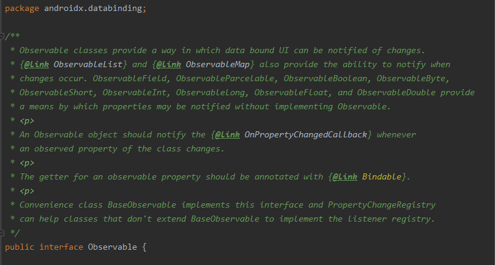
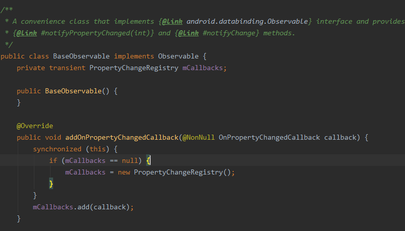
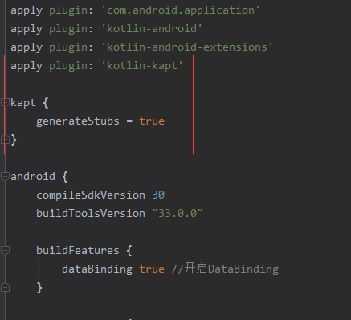
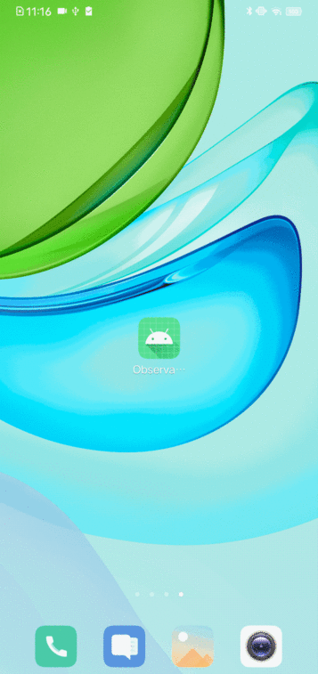

# Observable观察者模式下的UI更新

`Observable`英文直译为`可观察的`, 对于观察者模式的解释如下:

> 观察者模式: 当一个对象被修改时，则会自动通知依赖它的对象。观察者模式属于行为型模式。

`Observable`结合`dataBinding`能够实现, 对象内容更新之后UI自动刷新。

相信在上一篇[dataBinding](DataBinding/readme.md)文章中, 你已经对dataBinding绑定变量轻车熟路了, 也不知道你有没有试过, 在按钮被点击之后, 让`张三`变成`李三`呢?

你大可将下面的代码复制到你的项目中, 运行试试。

`activity_main.xml`中的代码

```xml
<?xml version="1.0" encoding="utf-8"?>
<layout xmlns:android="http://schemas.android.com/apk/res/android"
    xmlns:app="http://schemas.android.com/apk/res-auto">

    <data>
        <variable name="user" type="你的包名.User" />
        <variable name="presenter" type="你的包名.MainActivity" />
    </data>

    <androidx.constraintlayout.widget.ConstraintLayout
        android:layout_width="match_parent"
        android:layout_height="match_parent">

        <TextView
            android:id="@+id/textView"
            android:layout_width="wrap_content"
            android:layout_height="wrap_content"
            android:text="@{user.name}"
            app:layout_constraintBottom_toBottomOf="parent"
            app:layout_constraintLeft_toLeftOf="parent"
            app:layout_constraintRight_toRightOf="parent"
            app:layout_constraintTop_toTopOf="parent" />

        <Button
            android:id="@+id/changeName"
            android:layout_width="wrap_content"
            android:layout_height="wrap_content"
            android:onClick="@{presenter::onClick}"
            android:text="Button"
            app:layout_constraintBottom_toBottomOf="parent"
            app:layout_constraintEnd_toEndOf="parent"
            app:layout_constraintStart_toStartOf="parent"
            app:layout_constraintTop_toBottomOf="@+id/textView" />

    </androidx.constraintlayout.widget.ConstraintLayout>
</layout>
```

`MainActivity.kt`中的代码

```kotlin
class MainActivity : AppCompatActivity() {

    private lateinit var binding: ActivityMainBinding
    override fun onCreate(savedInstanceState: Bundle?) {
        super.onCreate(savedInstanceState)
        binding = ActivityMainBinding.inflate(layoutInflater)
        setContentView(binding.root)

        binding.user = User("张三", 18, false)
        binding.presenter = this
    }


    fun onClick(view: View?) {
        binding.user?.name = "李三"
        //binding.user = binding.user?.copy(name = "李三")
    }

    override fun onDestroy() {
        super.onDestroy()
        binding.unbind()
    }
}
```

`User.kt`

```kotlin
data class User(var name: String, var age: Int, var member: Boolean)
```

本文所用开发环境以及SDK版本如下，读者应该使用不低于本文所使用的开发环境.

> Android Studio 4.0.1
> minSdkVersion 21
> targetSdkVersion 30

温馨提示: 如果是创建新项目那么记得开启`build.gradle`中的`dataBinding`哦~

# 正文

> 注意：Android Studio 3.1 及更高版本允许用 LiveData 对象替换可观察字段，从而为您的应用提供额外的好处。如需了解详情，请参阅使用 LiveData 将数据变化通知给界面。

官方的建议是直接用`LiveData`代替`Observable`, 虽然...但是...还是要讲讲这东西是怎么用的。

如果你不想看, 那就不看~

先来认识一下, 隶属于`Observable`的常用基本类型

|       对象名       |                         说明                          |
| :----------------: | :---------------------------------------------------: |
| ObservableBoolean  |                 可观察的`Boolean`对象                 |
|   ObservableByte   |                  可观察的`Byte`对象                   |
|   ObservableChar   |                  可观察的`Char`对象                   |
|  ObservableShort   |                  可观察的`Short`对象                  |
|   ObservableInt    |                  可观察的`Int `对象                   |
|   ObservableLong   |                  可观察的`Long`对象                   |
|  ObservableFloat   |                  可观察的`Float`对象                  |
|  ObservableDouble  |                 可观察的`Double`对象                  |
| ObservableField<T> | 值得注意的是它是一个单独的对象, 跟`Field`没有任何关系 |

集合类型

|       对象名        |          说明           |
| :-----------------: | :---------------------: |
| ObservableArrayMap  | 可观察的`ArrayMap`对象  |
| ObservableArrayList | 可观察的`ArrayList`对象 |

# 基本`Observable`的使用

接下来, 就一起来用用这些东西。

首先修改`User.kt`

```kotlin
data class User(
    var name: ObservableField<String>,
    var age: ObservableInt,
    var member: ObservableBoolean
)
```

然后, 修改`MainEventPresenter.kt`

```kotlin
class MainEventPresenter {
    fun onClick(view: View?, user: User) {
        user.name.set("李三")
    }
}
```

`MainActivity.kt`

```kotlin
    override fun onCreate(savedInstanceState: Bundle?) {
        super.onCreate(savedInstanceState)
        binding = ActivityMainBinding.inflate(layoutInflater)
        setContentView(binding.root)
        binding.apply {
            user = User( ObservableField<String>("张三"),ObservableInt(23),ObservableBoolean(false))
            presenter = MainEventPresenter();
        }
    }
```

`activity_main.xml`

```xml
<?xml version="1.0" encoding="utf-8"?>
<layout xmlns:android="http://schemas.android.com/apk/res/android"
    xmlns:app="http://schemas.android.com/apk/res-auto">

    <data>
        <variable name="user" type="com.example.observable.bean.User" />
        <variable name="presenter" type="com.example.observable.event.MainEventPresenter" />
    </data>

    <androidx.constraintlayout.widget.ConstraintLayout
        android:layout_width="match_parent"
        android:layout_height="match_parent">

        <TextView
            android:id="@+id/userName"
            android:layout_width="wrap_content"
            android:layout_height="wrap_content"
            android:text="@{user.name}"
            app:layout_constraintBottom_toBottomOf="parent"
            app:layout_constraintLeft_toLeftOf="parent"
            app:layout_constraintRight_toRightOf="parent"
            app:layout_constraintTop_toTopOf="parent" />

        <Button
            android:id="@+id/changeName"
            android:layout_width="wrap_content"
            android:layout_height="wrap_content"
            android:onClick="@{(view)->presenter.onClick(view, user)}"
            android:text="Button"
            app:layout_constraintEnd_toEndOf="parent"
            app:layout_constraintStart_toStartOf="parent"
            app:layout_constraintTop_toBottomOf="@+id/authorityName" />

    </androidx.constraintlayout.widget.ConstraintLayout>
</layout>
```

然后, 跑一遍看效果。


# 自定义`Observable`与`BaseObservable`

上面我们介绍了`Observable`基本类型的用法。

然而, 在有些时候, 基本类型满足不了某些需求, 这个时候就需要自定义`Observable`了。

`Observable`实际上是一个接口, 它规范了实现它的所有类。



`BaseObservable`作为`Observable`接口实现类, 内部维护了一个`PropertyChangeRegistry`消息机制, 通过`notifyChange`和`notifyPropertyChanged`去回调`notifyCallbacks`方法, 进行递归检查数据的变化。

所以, 就不需要我们再去直接实现`Observable`接口了。



那么, 创建一个类继承`BaseObservable`.

`Authority.kt`

```kotlin
import androidx.databinding.BaseObservable
import androidx.databinding.Bindable
import com.example.observable.BR
class ObsUser : BaseObservable() {

    @get:Bindable
    var name: String = ""
        set(value) {
            //name = value //不要这么写, 用field来代替, 这么写默认调用的是setName()会造成死递归.
            field = value
            notifyPropertyChanged(BR.name)
        }

    @get:Bindable
    var age: Int = 0
        set(value) {
            field = value
            //notifyChange() //更新所有实例
            notifyPropertyChanged(BR.age)
        }

    @get:Bindable
    var member: Boolean = false
        set(value) {
            field = value
            notifyPropertyChanged(BR.member)
        }
}
```

`@get:Bindable`的说明, 上面的代码中出现了一个诸如:`notifyPropertyChanged(BR.name)`的东西, 这个方法顾名思义就是`通知某一个属性的状态改变`, 该方法接收一个`Int`参数。

表示`构建资源ID编号`, 也就是`BR.ID编号`并且编号名和该`属性名(字段)`相同。

需要注意的是`BR`类并不是凭空出现的, 只有当该属性(字段)被`@get:Bindable`标注之后, BR才会自动构建`资源ID编号`。

并且在`古老版本的Android Studio上可能不会自动构建`(简单来说就是: 虽然已经标注了`@get:Bindable`, 但是产生的`BR`类中根本没有该`ID编号`, 甚至还可能出现`BR`类都没生成的情况)这个时候就需要有以下操作了。

- 打开`app`级`build.grade`在文件中配置如下:



```kotlin
...
apply plugin: 'kotlin-kapt'

kapt {
    generateStubs = true
}
...
```

还有一件事: `kotlin-kapt注解构建处理`是需要`kotlin`支持滴哦~

还要记得`Build -> Clear Project`一下项目哦~

现在我们自定义的`Observable`已经成了, 简单来说就是在`set`方法中调用了父类的`notify...`方法。

现在我们来使用试试。

修改`activity_main.xml`

```xml
<?xml version="1.0" encoding="utf-8"?>
<layout xmlns:android="http://schemas.android.com/apk/res/android"
    xmlns:app="http://schemas.android.com/apk/res-auto">

    <data>
        <import type="android.view.View" />
        <variable name="obsUser" type="com.example.observable.bean.ObsUser" />
        <variable name="presenter" type="com.example.observable.event.MainEventPresenter" />
    </data>

    <androidx.constraintlayout.widget.ConstraintLayout
        android:layout_width="match_parent"
        android:layout_height="match_parent">

        <TextView
            android:id="@+id/userName"
            android:layout_width="wrap_content"
            android:layout_height="wrap_content"
            android:text="@{obsUser.name}"
            app:layout_constraintBottom_toBottomOf="parent"
            app:layout_constraintLeft_toLeftOf="parent"
            app:layout_constraintRight_toRightOf="parent"
            app:layout_constraintTop_toTopOf="parent" />

        <TextView
            android:id="@+id/userMember"
            android:layout_width="wrap_content"
            android:layout_height="wrap_content"
            android:text="团员"
            android:visibility="@{obsUser.member ? View.VISIBLE : View.GONE}"
            app:layout_constraintEnd_toEndOf="parent"
            app:layout_constraintStart_toStartOf="parent"
            app:layout_constraintTop_toBottomOf="@+id/userName" />

        <Button
            android:id="@+id/changeUser"
            android:layout_width="wrap_content"
            android:layout_height="wrap_content"
            android:onClick="@{(view)->presenter.onClick(view, obsUser)}"
            android:text="ChangeUser"
            android:textAllCaps="false"
            app:layout_constraintEnd_toEndOf="parent"
            app:layout_constraintStart_toStartOf="parent"
            app:layout_constraintTop_toBottomOf="@+id/userMember" />

    </androidx.constraintlayout.widget.ConstraintLayout>
</layout>
```

修改`MainEventPresenter.kt`

```kotlin
class MainEventPresenter {
    fun onClick(view: View?, user: ObsUser) {
        if(user.name == "张三"){
            user.name = "李三"
            user.age = 23
            user.member = true
        }else{
            user.name = "张三"
            user.age = 18
            user.member = false
        }
    }
}
```

修改`MainActivity.kt`

```kotlin
class MainActivity : AppCompatActivity() {

    private lateinit var binding: ActivityMainBinding

    override fun onCreate(savedInstanceState: Bundle?) {
        super.onCreate(savedInstanceState)
        binding = ActivityMainBinding.inflate(layoutInflater)
        setContentView(binding.root)

        binding.apply {
            obsUser = ObsUser().apply {
                name = "张三"
                age = 18
                member = false
            }
            presenter = MainEventPresenter();
        }
    }

    override fun onDestroy() {
        super.onDestroy()
        binding.unbind()
    }
}
```

然后, 跑一遍看效果。



到这里 `Observable` 就结束了。

同样的你可以在[github](https://github.com/GangJust/android_jetpack_demo)上找到本项目`Observable`的示例代码`https://github.com/GangJust/android_jetpack_demo`