# ViewModel和LiveData的使用

> 时(摸)隔(鱼)了小半个月, 终于开始了ViewModel和LiveData.

首先, 在开始之前, 说明一下: 什么是`ViewModel`? 什么又是`LiveData`?

## 什么是ViewModel?

老套路, `ViewModel`英文直译: `视图模型`。官方原话:**`ViewModel`旨在以注重生命周期的方式存储和管理界面相关的数据。**

的确, 这话很官方, 用直白的话来讲: ** `视图(View)` 和 `数据(Data)` 的桥梁[(MVVM亦或者MVC中都有的概念)](https://zhuanlan.zhihu.com/p/268127997), 是将`视图`和`数据`分离开来, 降低UI与数据的耦合性, 即提高代码的可读性、可维护性。**

在官方的介绍中, `ViewModel`可谓是`掌控全局`, 就因为它活得久。

从`生命周期`的`onCreate`开始, 一直到`onDestroy`结束, 期间不管应用是切后台、还是转前台, 它都不会消失。

以下又是官方原话:

> ViewModel 对象存在的时间范围是获取 ViewModel 时传递给 ViewModelProvider 的 Lifecycle。ViewModel 将一直留在内存中，直到限定其存在时间范围的 Lifecycle 永久消失：对于 Activity，是在 Activity 完成时；而对于 Fragment，是在 Fragment 分离时。


还有需要特别注意的是:

> `ViewModel`通常是在`onCreate`中被开发者**手动构建**, 而它会在`onDestroy`时被系统**自动抹除`onCleared()`**。

> **!注意!** ViewModel 绝对不要引用任何携带`Context`(包括`Lifecycle`也是携带有`Activity`)的对象; 正如上面所说, ViewModel命长, 对`Context`的引用可能会造成`内存泄露`, 如果确要使用Context可以试试`AndroidViewModel`, 因为`AndroidViewModel`默认携带了一个`Application`。

## 什么是LiveData?

`LiveData`的英文直译: `具有生命的数据`, 它是`可观察的数据存储类`(这里又出现了: 观察者模式), 那既然是具有生命的我们前文提到的[Lifecycle](https://blog.csdn.net/AoXue2017/article/details/126253660)就派上用场了。

那么`LiveData`中的`可观察`就是`生命周期(Lifecycle)`的可观察了。

好了, 这里需要补充一下前文[Lifecycle](https://blog.csdn.net/AoXue2017/article/details/126253660)的内容。

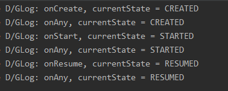

前面这张图上`Log`了一个`currentState`表示当前的生命周期状态, 不难看出`currentState`和生命周期函数的命名是一样的。

> `LiveData`只会通知`currentState`处于`STARTED`或`RESUMED`状态下的数据进行`更新`, 在其它情况下`LiveData`会判定为`非活跃状态`, 将不会对这些状态下的数据下发更新通知。

该扯的都扯完了, 接下来进入正文。

本文所用开发环境以及SDK版本如下，读者应该使用不低于本文所使用的开发环境.

> Android Studio 4.0.1
> minSdkVersion 21
> targetSdkVersion 30

# 正文

## ViewModel的基本使用

在使用`LiveData`之前我们需要先自定义自己的`ViewModel`视图模型.

```kotlin
class MainVM : ViewModel() {}
```

然后在`MainActivity.kt`中构建它, 这里介绍两种方式。

方式一, 通过 `ViewModelProvider` 构建:

```kotlin
    private lateinit var mainVm: MainVM
    override fun onCreate(savedInstanceState: Bundle?) {
        super.onCreate(savedInstanceState)
        binding = ActivityMainBinding.inflate(layoutInflater)
        setContentView(binding.root)
        mainVm = ViewModelProvider(MainActivity@ this).get(MainVM::class.java)
        //mainVm = ViewModelProvider(MainActivity@ this, ViewModelProvider.NewInstanceFactory()).get(MainVM::class.java)
    }
```

方式二, 通过`kotlin`扩展依赖构建(仅适用`kotlin`):

- 首先在App级的`build.gradle`中, 添加`kotlin`扩展依赖
  `androidx`所支持的依赖.
  ```kotlin
    def fragment_version = "1.3.1" /// 本文所依赖的开发环境不支持1.3.1以上的版本, 读者自行更改版本号
    implementation "androidx.activity:activity-ktx:$fragment_version"
    implementation "androidx.fragment:fragment-ktx:$fragment_version"
  ```
  [构建版本号列表`androidx.activity`](https://developer.android.google.cn/jetpack/androidx/releases/appcompat)
  [构建版本号列表`androidx.fragment`](https://developer.android.google.cn/jetpack/androidx/releases/fragment)

- 然后修改`MainActivity.kt`中的代码
  ```kotlin
  import androidx.activity.viewModels
  class MainActivity : AppCompatActivity() {
      private lateinit var binding: ActivityMainBinding
      private val mainVm: MainVM by viewModels() /// 委托加载
      override fun onCreate(savedInstanceState: Bundle?) {
        binding = ActivityMainBinding.inflate(layoutInflater)
        setContentView(binding.root)
      }
  }
  ```

到这一步, ViewModel就已经能够被使用了, 它将一直存活至当前`Activity`结束。

## LiveData的基本使用

`LiveData`自己实现了一套观察者机制, 它在监测到数据改变之后会自动的到通知`observe()`方法, 你可以在`observe()`方法中书写UI更新的代码。

计数器这个例子好像已经被写烂了, 但是不妨碍它是最简单的例子。

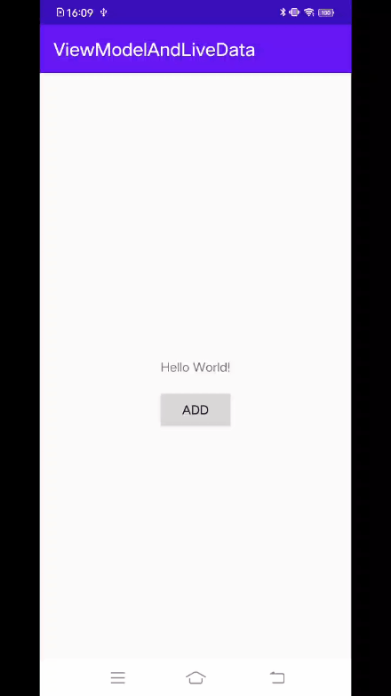

`LiveData`需要配合`ViewModel`一起使用, 使用很简单, 一行代码就能搞定。

我们修改代码`MainVM.kt`中的代码

```kotlin
  class MainVM : ViewModel() {
    var count: MutableLiveData<Int> = MutableLiveData()
  }
```

然后, 就可以在`MainActivity.kt`中调用它。

```kotlin
  import androidx.activity.viewModels
  class MainActivity : AppCompatActivity() {
      private lateinit var binding: ActivityMainBinding
      private val mainVm: MainVM by viewModels()
      override fun onCreate(savedInstanceState: Bundle?) {
        binding = ActivityMainBinding.inflate(layoutInflater)
        setContentView(binding.root)

        /// 只需要在这里写观察回调, liveData将自动监测数据变化
        mainVm.count.observe(MainActivity@ this) {
            binding.myTextView.text = "$it"  //setText()
        }

        /// add按钮, 设置点击事件, 直接更改 count 的值
        binding.add.setOnClickListener {
            mainVm.count.value = (mainVm.count.value ?: 0) + 1
        }
      }
  }
```

好了, 这个例子就这么完了, ViewModel和LiveData的使用到此结束。

## LiveData和ViewModel在Fragment中的使用

LiveData和ViewModel的强大不止于此,  在此之前`Framgent`之间的通信很繁琐, 然而有了`ViewModel`之后, 彻底被简化了。

上图, 上代码！

首先是`Fragment`容器

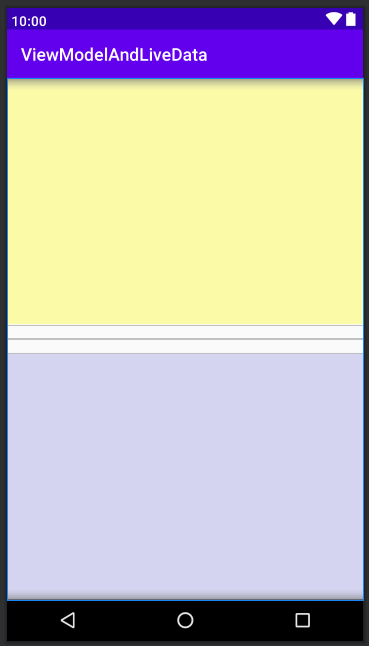

`activity_second.xml`

```xml
<?xml version="1.0" encoding="utf-8"?>
<LinearLayout xmlns:android="http://schemas.android.com/apk/res/android"
    android:layout_width="match_parent"
    android:layout_height="match_parent"
    android:orientation="vertical">

    <androidx.fragment.app.FragmentContainerView
        android:id="@+id/firstFragment"
        android:name="com.example.vl.fragment.FirstFragment"
        android:layout_width="match_parent"
        android:layout_height="0dp"
        android:layout_weight="1"
        android:background="#55fafa00" />

    <View
        android:layout_width="match_parent"
        android:layout_height="1dp"
        android:layout_marginVertical="16dp"
        android:background="@color/colorPrimary" />

    <androidx.fragment.app.FragmentContainerView
        android:id="@+id/secondFragment"
        android:name="com.example.vl.fragment.SecondFragment"
        android:layout_width="match_parent"
        android:layout_height="0dp"
        android:layout_weight="1"
        android:background="#558787dd" />
</LinearLayout>
```

然后是`fragment_first.xml`

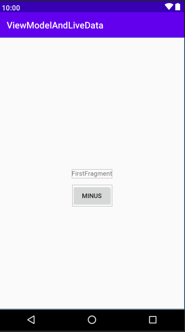

```xml
<?xml version="1.0" encoding="utf-8"?>
<androidx.constraintlayout.widget.ConstraintLayout xmlns:android="http://schemas.android.com/apk/res/android"
    xmlns:app="http://schemas.android.com/apk/res-auto"
    xmlns:tools="http://schemas.android.com/tools"
    android:layout_width="match_parent"
    android:layout_height="match_parent"
    tools:context=".fragment.FirstFragment">

    <TextView
        android:id="@+id/textView"
        android:layout_width="wrap_content"
        android:layout_height="wrap_content"
        android:text="FirstFragment"
        app:layout_constraintBottom_toBottomOf="parent"
        app:layout_constraintLeft_toLeftOf="parent"
        app:layout_constraintRight_toRightOf="parent"
        app:layout_constraintTop_toTopOf="parent" />

    <Button
        android:id="@+id/minus"
        android:layout_width="wrap_content"
        android:layout_height="wrap_content"
        android:layout_marginTop="16dp"
        android:text="minus"
        app:layout_constraintEnd_toEndOf="parent"
        app:layout_constraintStart_toStartOf="parent"
        app:layout_constraintTop_toBottomOf="@+id/textView" />

</androidx.constraintlayout.widget.ConstraintLayout>
```

再然后是`fragment_second.xml`

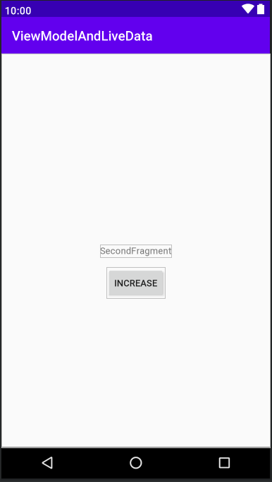

```xml
<?xml version="1.0" encoding="utf-8"?>
<androidx.constraintlayout.widget.ConstraintLayout xmlns:android="http://schemas.android.com/apk/res/android"
    xmlns:app="http://schemas.android.com/apk/res-auto"
    xmlns:tools="http://schemas.android.com/tools"
    android:layout_width="match_parent"
    android:layout_height="match_parent"
    tools:context=".fragment.SecondFragment">

    <TextView
        android:id="@+id/textView2"
        android:layout_width="wrap_content"
        android:layout_height="wrap_content"
        android:text="SecondFragment"
        app:layout_constraintBottom_toBottomOf="parent"
        app:layout_constraintLeft_toLeftOf="parent"
        app:layout_constraintRight_toRightOf="parent"
        app:layout_constraintTop_toTopOf="parent" />

    <Button
        android:id="@+id/increase"
        android:layout_width="wrap_content"
        android:layout_height="wrap_content"
        android:layout_marginTop="16dp"
        android:text="increase"
        app:layout_constraintEnd_toEndOf="parent"
        app:layout_constraintStart_toStartOf="parent"
        app:layout_constraintTop_toBottomOf="@+id/textView2" />

</androidx.constraintlayout.widget.ConstraintLayout>
```

布局画好了之后, 就是代码了, `Fragment`只列出关键代码了。

`FirstFragment.kt`

```kotlin
class FirstFragment : Fragment() {
    private val secondVM:SecondVM by activityViewModels()
    ...
    override fun onCreateView(inflater: LayoutInflater, container: ViewGroup?, savedInstanceState: Bundle?): View {
        binding = FragmentFirstBinding.inflate(inflater, container, false)

        secondVM.number.observe(requireActivity()) {
            binding.textView.text = "$it"
        }

        binding.minus.setOnClickListener {
            secondVM.onMinus()  //递减
        }

        return binding.root
    }
}
```

`SecondFragment.kt`

```kotlin
class SecondFragment : Fragment() {
    private lateinit var secondVM: SecondVM
    ...
    override fun onCreate(savedInstanceState: Bundle?) {
        super.onCreate(savedInstanceState)
        secondVM = ViewModelProvider(requireActivity(), ViewModelProvider.NewInstanceFactory()).get(SecondVM::class.java)
    }
    ...
    override fun onCreateView(inflater: LayoutInflater, container: ViewGroup?, savedInstanceState: Bundle?): View {
        // Inflate the layout for this fragment
        binding = FragmentSecondBinding.inflate(inflater, container, false)

        secondVM.number.observe(requireActivity()) {
            binding.textView2.text = "$it"
        }

        binding.increase.setOnClickListener {
            secondVM.onIncrease()  //递增
        }

        return binding.root
    }
}
```

`SecondVM.kt`

```kotlin
class SecondVM : ViewModel() {
    private var _number: MutableLiveData<Int> = MutableLiveData()
    val number: LiveData<Int> = _number //LiveData不允许通过 setValue 和 postsValue 更新数据

    fun onIncrease() {
        //前文没提, 这里的 value = ... 因为kotlin的特性, 调用的是 setValue() 方法
        _number.value = (_number.value ?: 0) + 1
    }

    fun onMinus() {
        _number.value = (_number.value ?: 0) - 1
    }
}
```

`SecondFragment.kt`

```kotlin
class SecondActivity : AppCompatActivity() {
    //private val secondVM: SecondVM by viewModels()
    override fun onCreate(savedInstanceState: Bundle?) {
        super.onCreate(savedInstanceState)
        setContentView(R.layout.activity_second)
    }
}
```

这里可以不用书写 `secondVM: SecondVM by viewModels()` 为什么?

因为我们创建`ViewModel`对象并不是通过`new`去创建的(也千万不要通过`new`去创建), 而`ViewModelProvider.Factory`下文将做解释。

ViewModelProvider会寻找内存中已经被创建的`ViewModel`, 如果没有找到, 那么它会去创建一个新的。

我们跑一遍上面的代码。

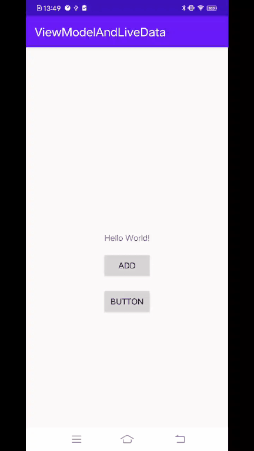

可以发现, 不管是点击上面的按钮, 还是点击下面的按钮, 两个`TextView`的内容都发生了改变。

## LiveData和MutableLiveData

通过上面的代码发现, 我们既使用`LiveData`又使用了`MutableLiveData`, 那么它们的关系如何呢? 为什么说`LiveData`不能修改(更新)数据?

我们看到`MutableLiveData`的源码

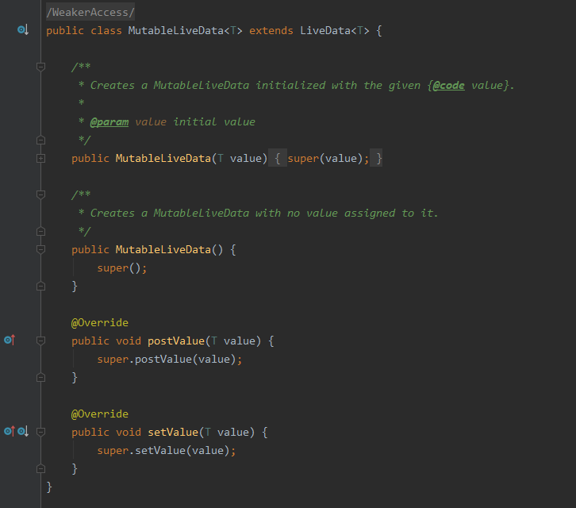

发现它是直接继承`LiveData`的, 虽然重写了`setValue()`和`postValue()`这两个方法, 但是没有加入任何新的代码, 而是直接`super`父类方法。

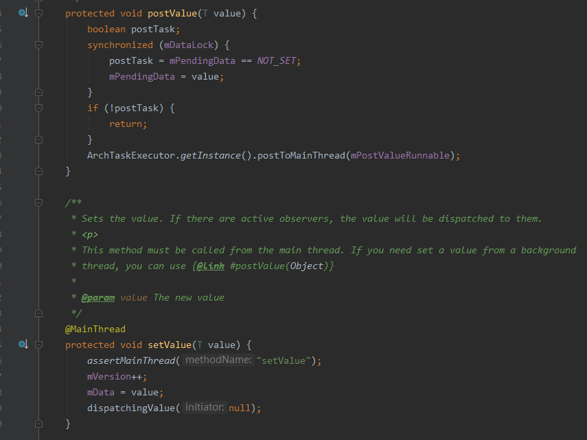

点开父类`LiveData`才发现, 原来`MutableLiveData`只做了一件事情, 就是将`protected` -> `public` 了。

至于`postValue`和`setValue`的区别：在于`postsValue`处理多线程模式下的数据更新(但是UI的更新还是在主线程下), `setValue`只能在单线程模式下使用(你可以试试在多线程中调用`setValue`的情况)

值得注意的是`postsValue`可能会造成数据丢失, 具体查看【[面试官：你了解 LiveData 的 postValue 吗？](http://mp.weixin.qq.com/s?src=11&timestamp=1660729411&ver=3988&signature=Q9R6KP2Z01hxDrLwM3NL8df9LpfTqej35K*srE7AzoLQxNHKfpaERyZkqAJtOd-SMOOHs0shgol1HL-RpQlHQDICV1q*1eFUer43ghuKWsfFRiUdVF0m0mTyfsHNRiva&new=1)】这篇文章, 这里就不做赘述了。

## 为什么要用ViewModelProvider去构建ViewModel?

前面提到了**千万不要通过`new`去创建ViewModel**, 至于原因, 我们这里简单看一下`ViewModelProvider`的相关源码。

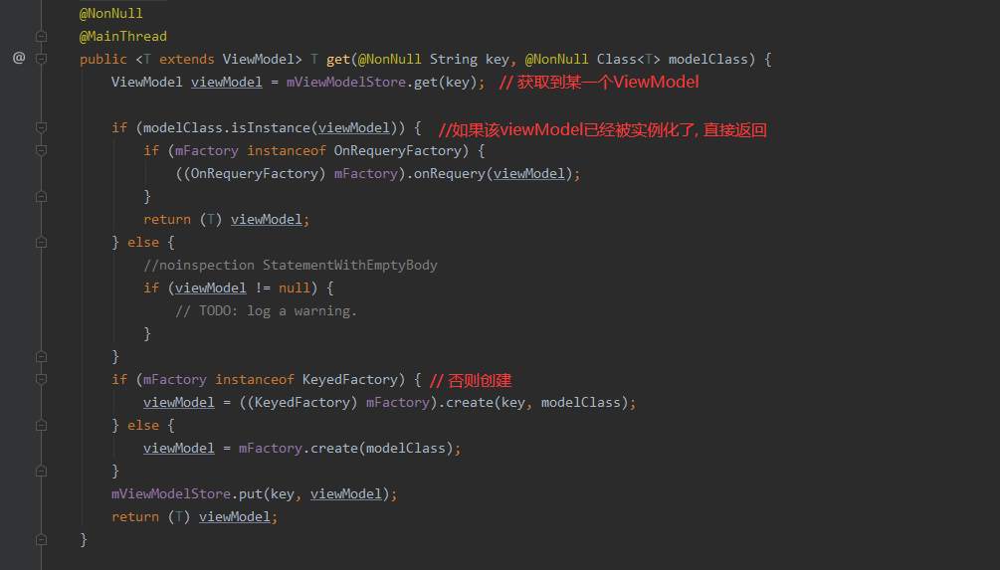

上图可以看到, ViewModelProvider内部维护了一个`private final ViewModelStore mViewModelStore`, 如果没有找到对应的`ViewModel`, 那么就通过`mFactory.create(modelClass)`去创建实例(ViewModelFactory马上登场)。

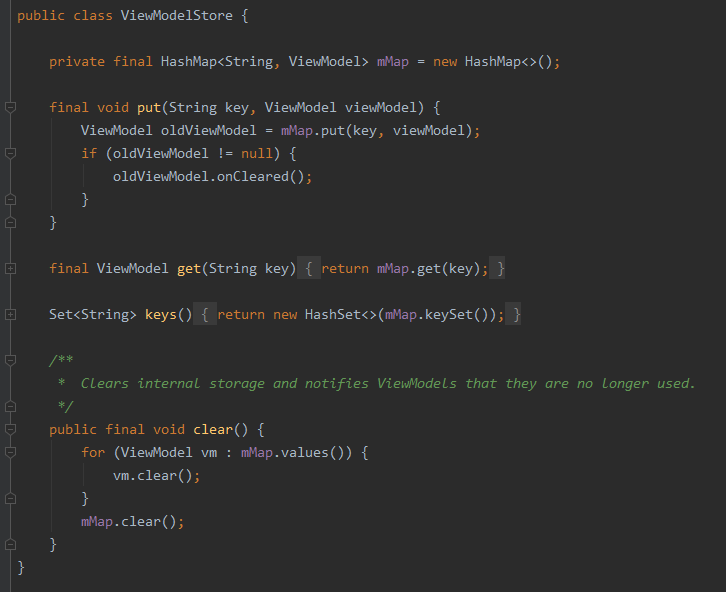

而`ViewModelStore`内部就是通过HashMap的特性来确保`ViewModel`的唯一性。

上面提到了, `get()方法`通过`ViewModelProvider.ViewModelFactory`的`create(modelClass)`方法来创建实例。

而且, 我们在使用`ViewModelProvider`的时候, 通常都提供了一个`ViewModelProvider.NewInstanceFactory()`, 来看到下图它的结构。

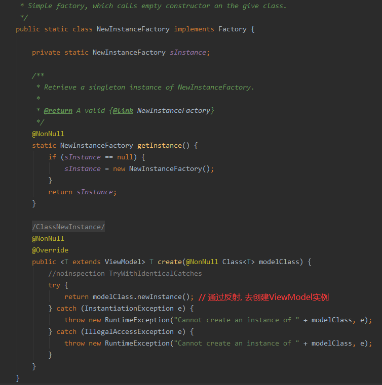

`反射！`好家伙, 原来`ViewModel`实例就在这里创建的。

## 自定义`ViewModelFactory`

既然知道了ViewModel是通过`反射`创建的, 那就好办了; 现在有个需求: `在ViewModel初始化的时候, 需要参数初始化`。

图来!!

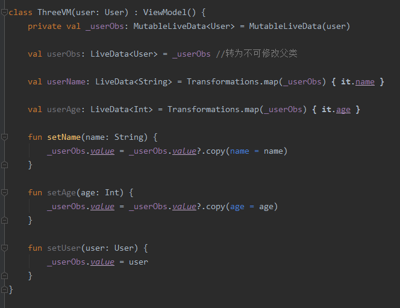

[Transformations详解【点介里哇】](https://blog.csdn.net/kou_gyouu/article/details/85502548)

就需要我们自己实现`ViewModelProvider.ViewModelFactory`了

```kotlin
/// 自定义 ViewModelFactory
class ThreeViewModelFactory(var user: User) : ViewModelProvider.Factory {

    override fun <T : ViewModel?> create(modelClass: Class<T>): T {
        return modelClass.getConstructor(User::class.java).newInstance(user)
    }
}
```

自定义 ViewModelFactory` 只需要继承 `ViewModelFactory` 然后重写create方法即可。

通过`getConstructor(User::class.java)`获取到带参数构造函数, 然后`newInstance`传入`user`实例。

最后在`activity`中使用即可

```kotlin
class ThreeActivity : AppCompatActivity() {
    private lateinit var binding: ActivityThreeBinding
    private lateinit var vm: ThreeVM
    override fun onCreate(savedInstanceState: Bundle?) {
        super.onCreate(savedInstanceState)
        binding = ActivityThreeBinding.inflate(layoutInflater)
        setContentView(binding.root)

        vm = ViewModelProvider(this, ThreeViewModelFactory(User("张三", 18))).get(ThreeVM::class.java)

        // 观察数据变化
        vm.userName.observe(this) {
            binding.nameText.text = it
        }

        // 点击按钮改变user
        binding.changeName.setOnClickListener {
            // kotlin中的三目运算
            vm.setName(if (vm.userName.value == "李四") "张三" else "李四")
        }
    }
}
```

运行结果图

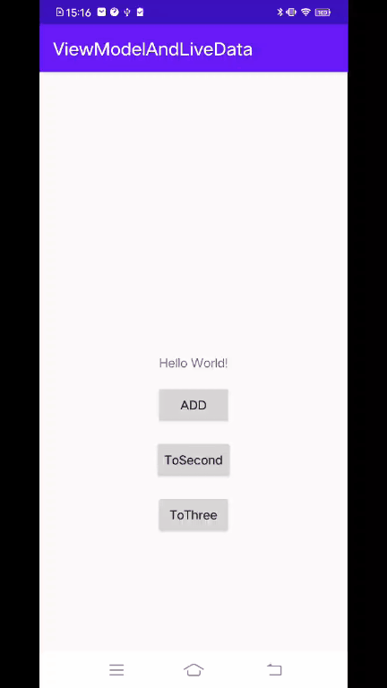